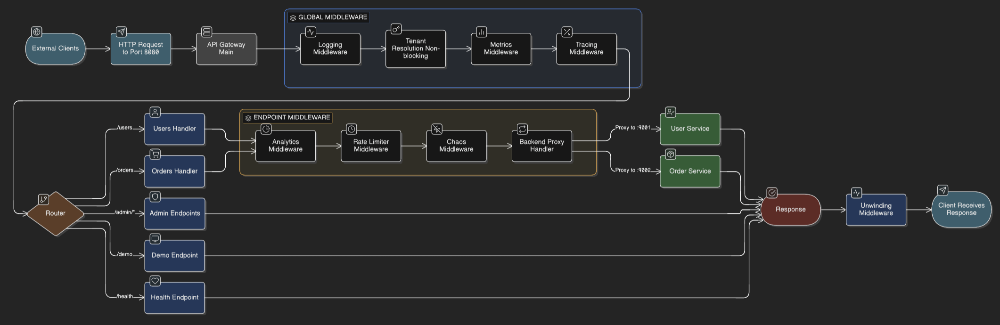

## 1) Overview
- Live gateway: https://centralized-api-orchestration-engine.onrender.com/demo
- Live Grafana dashboard: https://csrosex.grafana.net/public-dashboards/3c2996c1426f4726bbd53f729b5c2a2c
- Go-based API gateway with layered middleware (logging, tracing, metrics, tenant resolution) fronting user and order services via reverse proxy.
- Built for resilience and insight: rate limiting per tenant (Redis token bucket), chaos injection, and analytics capture for every attempt.

## 2) Highlights
- Request pipeline captures everything: logging → metrics → tracing → tenant resolution → analytics → rate limit → chaos → reverse proxy.
- Redis-backed state for rate limits and analytics keeps behavior consistent across instances and restarts.
- Observability-first: Prometheus at /metrics, JSON metrics at /admin/metrics, and OpenTelemetry tracing.
- Chaos controls (fail backend, latency, drop) with auto-recovery let you demo failure modes safely.
- Multi-tenant by header (`X-API-Key`) with per-tenant isolation for limits and analytics.

## 3) Live Observability
- Grafana dashboard (public): https://csrosex.grafana.net/public-dashboards/3c2996c1426f4726bbd53f729b5c2a2c
- Prometheus scrape: https://centralized-api-orchestration-engine.onrender.com/metrics
- JSON metrics: https://centralized-api-orchestration-engine.onrender.com/admin/metrics
- Traces: exported via OpenTelemetry (see internal/observability/otel.go) to your configured collector.

## 4) Chaos and Traffic Demo (5 minutes)
- Baseline: check status at /admin/chaos/status then hit /users with `X-API-Key: sk_test_123`.
- Induce failure: POST to /admin/chaos with `{ "fail_backend": true, "duration_sec": 30 }`, then hit /users to see 503s.
- Latency or drop tests: use `slow_ms` or `drop_percent` in the chaos payload; observe p95/p99 jump in Grafana within 30 seconds.
- Recovery: POST /admin/chaos/recover, send a few normal requests, and confirm metrics normalize.

## 5) Run Locally
- Prereqs: Go 1.22+, Redis (localhost:6379), ports 8080 (gateway), 9001/9002 (mock services).
- Start mocks: `go run mock-user.go` and `go run mock-order.go` (separate shells).
- Run gateway: `go run cmd/gateway/main.go`.
- Hit it: `curl -H "X-API-Key: sk_test_123" http://localhost:8080/users` or visit http://localhost:8080/demo.
